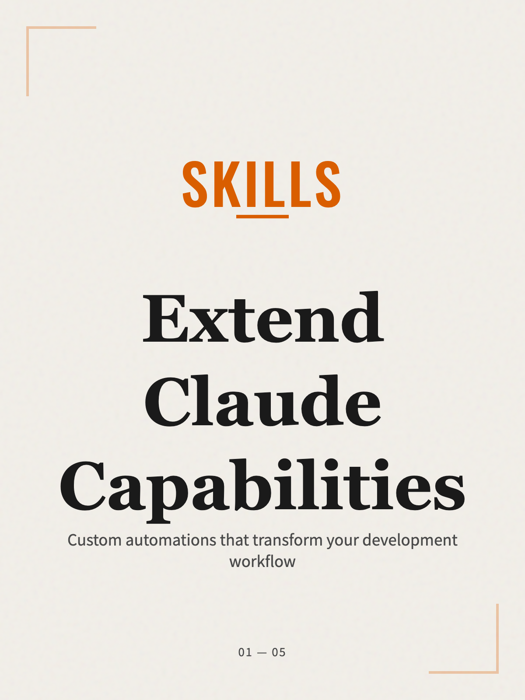

## Editorial Card Generator

> **Turn text into stunning editorial-style infographics** — with zero design effort.

A Claude Code skill that transforms your content into beautiful, magazine-style information cards. Perfect for social media, presentations, or knowledge sharing.

[中文文档](README.zh.md)


---

---

## ✨ Example Output

<div align="center">

### Generated in 30 seconds from this text:

> "Claude Skills are custom capabilities for Claude Code. Key benefits: Save Time, Consistency, Customization. How it works: Create Definition → Set Triggers → Configure Tools → Add Instructions. Use cases: Code generation, refactoring, documentation automation, testing, validation, configuration."

**Output:** 4 publication-ready cards

<table>
  <tr>
    <td></td>
    <td></td>
  </tr>
  <tr>
    <td></td>
    <td></td>
  </tr>
</table>

_Zero design skills. One-click export. Publication quality._

</div>

---

## Why This Skill?

Content creators face a universal problem:

- **Design is hard** — Not everyone can create professional visuals
- **Tools are expensive** — Figma, Canva, and Adobe require subscriptions
- **Time is scarce** — Learning design takes away from creating content
- **Consistency suffers** — Each design looks different from the last

This skill solves all of that with a single command.

## The Solution

Describe what you want → Get publication-ready HTML cards → Export as PNG

```
You: "Make an infographic about Tailwind CSS layoffs"
↓
Claude creates: 4 stunning cards with data, quotes, and analysis
↓
You click: "Export All Cards" → 4 high-res PNGs downloaded
```

## What Makes It Different?

| Feature             | This Skill                | Traditional Tools |
| ------------------- | ------------------------- | ----------------- |
| **Learning curve**  | Zero (just describe)      | Steep             |
| **Cost**            | Free                      | $10-60/month      |
| **Time per design** | ~30 seconds               | Hours             |
| **Consistency**     | Automatic (design system) | Manual effort     |
| **Export quality**  | 2x resolution PNG         | Varies            |

## Installation

### Option 1: Clone directly (Recommended)

```bash
# Navigate to your Claude Code skills directory
cd ~/.claude/skills  # or your custom skills path

# Clone this skill
git clone https://github.com/YOUR_USERNAME/editorial-card-generator.git
```

### Option 2: Manual installation

1. Download or copy the `editorial-card-generator` folder
2. Place it in your Claude Code skills directory:
   - macOS/Linux: `~/.claude/skills/`
   - Windows: `%USERPROFILE%\.claude\skills\`

### Verify Installation

In Claude Code, the skill will automatically activate when you:

- Ask to "make a poster", "create cards", or "design an infographic"
- Mention "visualize content" or "information graphics"
- Request "magazine-style design" or "editorial layout"

## Usage

### Example 1: Tech News

```
Create an infographic about this:

Tailwind CSS laid off 75% of staff. Revenue dropped 80% because
developers use AI tools like Cursor instead of reading docs.
The old business model (docs → traffic → sales) is broken.
```

**Output:** 4 cards with bold data visualization, dark-mode data card, and industry analysis

### Example 2: Educational Content

```
Make visual cards explaining:

What is Docker?
1. Containers package apps with dependencies
2. Run anywhere consistently
3. Faster than VMs, more isolated than bare metal
```

**Output:** Clean numbered list cards with definitions and use cases

### Example 3: Social Media Thread

```
Turn this twitter thread into cards:

[Thread about productivity tips...]
```

**Output:** Each tweet becomes a shareable card with consistent branding

---

## 🎨 Design System

Every card follows strict design principles:

### The Style

- **Movement**: Modern Editorial + Swiss International Style
- **Philosophy**: Order, contrast, large typography, paper texture
- **Format**: 600px × 800px (3:4 ratio) — perfect for Instagram, Twitter

### The Colors

```
Background: #f2efe9  (Warm cream paper)
Text:       #1a1a1a  (Deep charcoal)
Accent:     #d95e00  (Hermès orange)
```

### The Typography

- **Noto Serif SC** (700, 900) — Headlines
- **Noto Sans SC** (400, 500, 700) — Body text
- **Oswald** (500, 700) — Numbers and English

### The Texture

- SVG noise overlay (opacity 0.06) for paper feel
- Deep shadows (25px blur) for floating effect
- Subtle gradients and opacity shifts

## Card Types

The skill intelligently divides content across 3-6 cards:

### Card 1: The Cover

- Massive percentage or key number
- Bold headline (48-56px)
- Short tagline

### Card 2-N: Content

- **List cards**: Numbered sections (01/02/03)
- **Data cards**: Dark background, large stats, key quotes
- **Mixed layout**: Text + visual elements

### Card N: The Outro

- Summary or call-to-action
- Generous whitespace
- Thoughtful closing

## File Structure

```
editorial-card-generator/
├── SKILL.md        # Core instructions (what Claude reads)
├── examples/       # Real outputs
│   └── tailwind-crisis/
│       └── index.html
├── README.md       # This file
└── LICENSE         # MIT
```

## Technical Stack

- **Tailwind CSS** — Utility-first styling
- **FontAwesome** — Icons
- **html2canvas** — HTML to PNG export
- **Google Fonts** — Noto typography
- **SVG Filters** — Noise texture

## When to Use

**Perfect for:**

- Social media content (Instagram, Twitter, LinkedIn)
- Educational materials and tutorials
- Presentation slides
- Newsletter visuals
- Knowledge sharing
- Thread summarization

**Skip for:**

- Complex data visualization (use charts)
- Video content
- Interactive elements

## Acknowledgments

- **Swiss International Style** — Josef Müller-Brockmann and the Basel school
- **Google Fonts** — Noto type family
- **html2canvas** — Niklas von Hertzen
- **Anthropic** — Claude Code and Agent Skills framework

## Contributing

Contributions welcome! Please:

1. Fork the repository
2. Create a feature branch
3. Submit a pull request

Ideas for contributions:

- New color themes
- Additional card layouts
- More examples
- Design system improvements

## License

MIT License — feel free to use, modify, and distribute.

## Thank You

To everyone who stars, forks, and uses this skill — thank you. Good design should be accessible to everyone, not just those with design tools or training.

If this helps you create something beautiful, that's all I wanted.

---

**Made with ❤️ for Claude Code**
